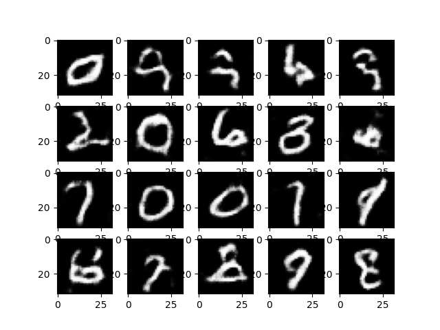

# InfoGAN - Generative Adversarial Network for MNIST digit Dataset: Generative Models

## Overview

InfoGAN (GAN-based Project for Synthesizing Grayscale images) is a machine learning project focused on generating synthetic images using Generative Adversarial Networks (GANs). Specifically, it is designed to work with the Custom dataset, a large database of handwritten digits commonly used for training various image processing systems.

## Features

- Utilizes PyTorch for implementing GAN models.
- Provides scripts for easy training and generating synthetic images.
- Command Line Interface for easy interaction.
- Includes a custom data loader for the Custom dataset.
- Customizable training parameters for experimenting with GAN.

## Installation

Clone the repository:

```
git clone https://github.com/atikul-islam-sajib/InfoGAN.git

cd InfoGAN
```

# Install dependencies

```
pip install -r requirements.txt
```

## Usage

Examples of commands and their explanations.

```bash
python /path/to/InfoGAN/src/cli.py --help
```

### Options

- `--batch_size` (int): Defines the batch size for training the model. Default is 128.
- `--image_size` (int): Specifies the size of images (height and width) to be used. Default is 32.
- `--in_channels` (int): Number of input channels in the images. This is required for model configuration.
- `--latent_space` (int): Dimensionality of the latent space from which the generator creates images. Default is 100.
- `--epochs` (int): Number of training epochs. Default is 10.
- `--lr` (float): Learning rate for the optimizer. Default is 0.0002.
- `--display` (bool): Flag to enable or disable display of generated images during training. Default is True.
- `--device` (str): Specifies the computing device ('cuda' or 'cpu') for model training and inference. Default is 'cuda'.
- `--num_samples` (int): Number of images to generate for testing. Default is 20.
- `--data` (action): Flag to indicate the use of MNIST digit data for the model. No default.
- `--test` (action): Flag to indicate testing mode. No default.

## Training and Generating Images(CLI)

### Training the GAN Model

To train the GAN model with default parameters with mps:

```
!python /content/InfoGAN/src/cli.py --batch_size 64 --image_size 32 --in_channels 1 --latent_space 100 --epochs 20 --lr 0.0001 --device mps --data
```

To train the GAN model with default parameters with gpu:

```
!python /content/InfoGAN/src/cli.py --batch_size 64 --image_size 32 --in_channels 1 --latent_space 100 --epochs 20 --lr 0.0001 --device cuda --data
```

To train the GAN model with default parameters with cpu:

```
!python /content/InfoGAN/src/cli.py --batch_size 64 --image_size 32 --in_channels 1 --latent_space 100 --epochs 20 --lr 0.0001 --device cpu --data
```

### Generating Images

To generate images using the trained model:

```
!python /content/InfoGAN/src/cli.py --num_samples 20 --latent_space 100 --device mps --test
```

### Viewing Generated Images

Check the specified output directory for the generated images.

```
from IPython.display import Image
Image(filename='/outputs/output_image/generated_images.png')
```

## Core Script Usage

The core script sets up the necessary components for training the GAN. Here's a quick overview of what each part does:

```python
from src.dataloader import Loader
from src.generator import Generator
from src.discriminator import Discriminator
from src.trainer import Trainer
from src.test import Test

# Initialize the data loader with batch size
loader = Loader(batch_size = 128, image_size=64)
dataloader = loader.download_mnist()

#================================================================================================================#

# Set up the trainer with learning rate, epochs, and latent space size
trainer = Trainer(
    epochs=200,
    in_channels=1,
    lr=0.0002,
    latent_space=100,
    batch_size=128,
    display=True,
    device="mps")

trainer.train()

#================================================================================================================#

# Test the generated dataset and display the synthetic images
test = Test(latent_space=100, num_samples=20)

test.test()

#================================================================================================================#

from IPython.display import Image
Image("/outputs/output_image/generated_images.png")
```

This script initializes the data loader, downloads the Custom dataset, and prepares the data loader. It then sets up and starts the training process for the GAN model.

<!-- ## Documentation

For detailed documentation on the implementation and usage, visit the [InfoGAN Documentation](https://atikul-islam-sajib.github.io/FIG-deploy/). -->

## Notebook Training

For detailed documentation on the implementation and usage using notebook, visit the [Notebook for CLI](./notebooks/Modeltrain_CLI.ipynb).

For detailed documentation on the implementation and usage using notebook, visit the [Notebook for Import Modules](./notebooks/ModelTrain_Import_Modules.ipynb).

## Contributing

Contributions to improve the project are welcome. Please follow the standard procedures for contributing to open-source projects.

## License

This project is licensed under [MIT LICENSE](./LICENSE). Please see the LICENSE file for more details.

## Acknowledgements

Thanks to all contributors and users of the InfoGAN project. Special thanks to those who have provided feedback and suggestions for improvements.

## Contact

For any inquiries or suggestions, feel free to reach out to [atikulislamsajib137@gmail.com].
